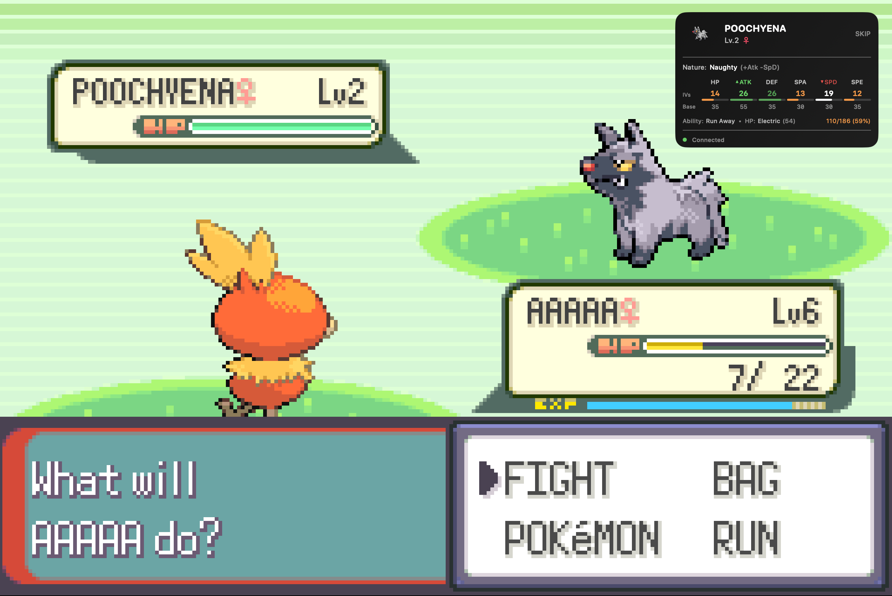
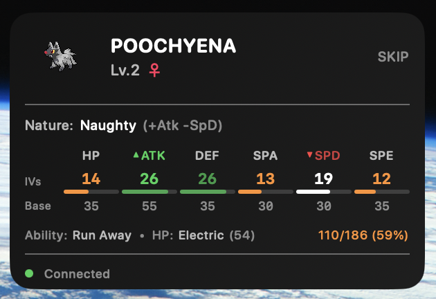

# PokeScan

A real-time IV overlay for Pokemon Emerald running on mGBA. Displays IVs, nature, ability, hidden power, and catch recommendations as a floating macOS window while you play.




## Features

- **Real-time IV display** - See all 6 IVs with color-coded quality indicators
- **Nature analysis** - Shows stat modifiers (+Atk/-Def, etc.)
- **Hidden Power** - Displays type and power
- **Catch criteria** - Configurable profiles to highlight Pokemon worth catching
- **Shiny detection** - Special alerts and visual effects for shinies
- **Floating overlay** - Stays on top, transparent when not in battle



## How It Works

PokeScan consists of two parts:
1. **Lua script** - Runs in mGBA, reads Pokemon data from memory, sends it over TCP
2. **Swift app** - Receives data, calculates IVs, displays the overlay

## Requirements

- macOS 13.0+
- [mGBA](https://mgba.io/) emulator
- Pokemon Emerald ROM (US or EU version)

## Installation

### One-Click Launcher (Recommended)

```bash
git clone https://github.com/Veridiann/PokeScan.git
cd PokeScan
./launcher/install.sh
```

Then edit `~/.config/pokescan/pokescan.conf` to set your ROM path:

```bash
ROM_PATH="$HOME/Games/Pokemon/Emerald.gba"
SAVE_SLOT="latest"  # or 0-9 for specific slot, "none" to skip
```

Double-click **PokeScan Launcher** in Applications to start everything automatically.

### Manual Setup

#### Build from Source

```bash
git clone https://github.com/Veridiann/PokeScan.git
cd PokeScan
swift build -c release
```

The built executable will be at `.build/release/PokeScan`.

#### Using Xcode

1. Open `Package.swift` in Xcode
2. Select the PokeScan scheme
3. Build and Run (Cmd+R)

## Usage

### With Launcher

Just double-click **PokeScan Launcher** in Applications. It will:
- Launch mGBA with your ROM and the Lua script
- Load your save state (if configured)
- Start the PokeScan overlay

### Manual Usage

1. **Start mGBA** with Pokemon Emerald loaded

2. **Load the Lua script** in mGBA:
   - Go to Tools → Scripting → File → Load Script
   - Select `lua/pokescan_sender.lua`

3. **Run PokeScan**:
   ```bash
   swift run
   # or run the built executable
   .build/release/PokeScan
   ```

4. **Enter a wild battle** - the overlay will display Pokemon data

### Catch Criteria

Right-click the overlay to:
- Switch between catch profiles
- Toggle sound alerts
- Edit the criteria file

Criteria are stored at `~/Library/Application Support/PokeScan/catch_criteria.json`:

```json
{
  "activeProfile": "high_ivs",
  "alwaysAlertShiny": true,
  "alertSoundEnabled": true,
  "profiles": {
    "high_ivs": {
      "name": "High IVs",
      "minIVPercent": 80,
      "notes": "Catch any Pokemon with 80%+ IVs"
    },
    "ralts": {
      "name": "Ralts Hunt",
      "species": ["Ralts"],
      "requiredNatures": ["Timid", "Modest"],
      "minIVs": {"spa": 25, "spe": 20}
    }
  }
}
```

## Project Structure

```
PokeScan/
├── lua/
│   ├── core/           # JSON encoding, socket server
│   ├── adapters/       # Game-specific memory addresses
│   └── pokescan_sender.lua
├── PokeScan/
│   ├── App/            # App entry point, window controller
│   ├── UI/             # SwiftUI views
│   ├── Models/         # Data structures
│   ├── Services/       # Socket client, criteria engine
│   └── Resources/      # Pokemon data, sprites, sounds
└── Package.swift
```

## Supported Games

Currently supports:
- Pokemon Emerald (US)
- Pokemon Emerald (EU)

Adding support for other Gen 3 games requires creating a new adapter in `lua/adapters/`.

## Credits

- Pokemon data sourced from [PokeAPI](https://pokeapi.co/)
- Sprites from the Pokemon games (Nintendo/Game Freak)
- Built with [mGBA](https://mgba.io/) Lua scripting API

## License

MIT License - see [LICENSE](LICENSE) for details.
